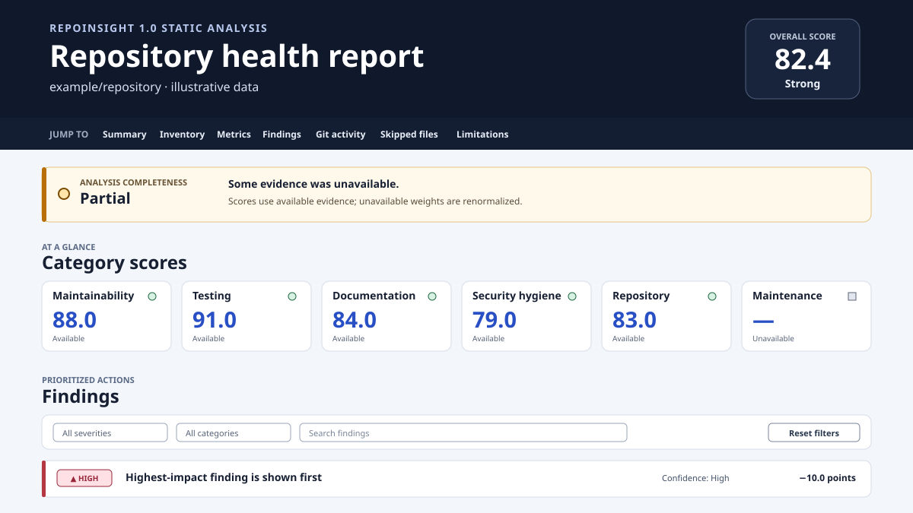

# RepoInsight

RepoInsight 1.0 is a cross-platform Python CLI that produces deterministic repository-health reports without importing or executing repository code. It analyzes local directories and public GitHub repositories with bounded file discovery, Python AST inspection, sanitized Git metadata, transparent scoring, a versioned JSON contract, and a standalone offline HTML report.



## Install

RepoInsight requires Python 3.11 or newer.

Install the current stable release from [PyPI](https://pypi.org/project/repoinsight/) with
`pipx` so the command runs in an isolated environment:

```console
pipx install repoinsight
repoinsight version
```

Upgrade an existing `pipx` installation with:

```console
pipx upgrade repoinsight
```

Alternatively, install RepoInsight into the current Python environment:

```console
python -m pip install repoinsight
repoinsight version
```

RepoInsight 1.0.0 is also available from its
[GitHub Release](https://github.com/HHP8/RepoInsight/releases/tag/v1.0.0).

## Quick start

```console
repoinsight analyze .
repoinsight analyze . --output reports --format all
repoinsight analyze https://github.com/pypa/sampleproject --output reports
repoinsight analyze . --fail-under 80
repoinsight rules
repoinsight explain RI-SEC-001
```

`analyze` prints a compact terminal summary. JSON and HTML output default to `repoinsight-report/`. The HTML file has no server or network dependency.

## Safety and privacy

Repository contents are untrusted input. RepoInsight never imports analyzed modules or runs repository scripts, build tools, tests, hooks, or configuration code. It blocks ordinary traversal and external symlink following, bounds discovery and Git acquisition, redacts secret-like text at trust boundaries, autoescapes report data, and removes temporary clones.

Version 1 does not defend against a concurrent privileged local attacker, a compromised operating system, a malicious system Git installation, a hostile executable `PATH`, or an adversarial filesystem driver. See [Security and privacy](docs/security.md) and [Known limitations](docs/limitations.md).

## Documentation

- [CLI reference](docs/cli.md)
- [Configuration](docs/configuration.md)
- [Rules](docs/rules.md)
- [Scoring](docs/scoring.md)
- [Architecture](docs/architecture.md)
- [Analyzer extension guide](docs/analyzers.md)
- [Security and privacy](docs/security.md)
- [Known limitations](docs/limitations.md)
- [Release process](docs/release.md)
- [Support](SUPPORT.md)

## Development from a source checkout

Use an editable installation with the development dependency group. On Windows:

```console
python -m venv .venv
.venv\Scripts\python -m pip install -e . --group dev
.venv\Scripts\python -m pytest -q
.venv\Scripts\python -m ruff format --check .
.venv\Scripts\python -m ruff check .
.venv\Scripts\python -m mypy src tests tools benchmarks
```

On macOS or Linux:

```console
python3 -m venv .venv
.venv/bin/python -m pip install -e . --group dev
.venv/bin/python -m pytest -q
.venv/bin/python -m ruff format --check .
.venv/bin/python -m ruff check .
.venv/bin/python -m mypy src tests tools benchmarks
```

The standard test suite needs no network access. The 100,000-line benchmark and live public-repository smoke are opt-in. See [CONTRIBUTING.md](CONTRIBUTING.md).

## License

MIT. See [LICENSE](LICENSE).
